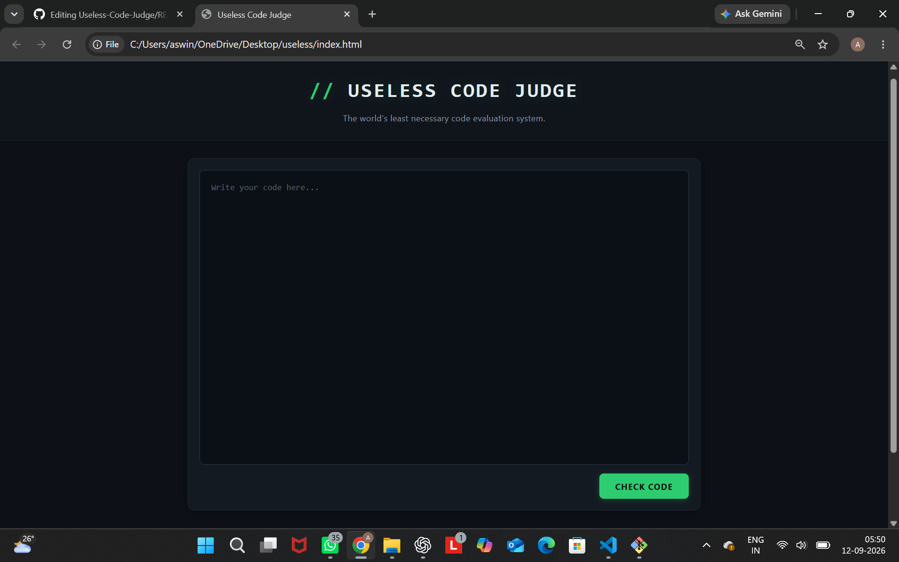
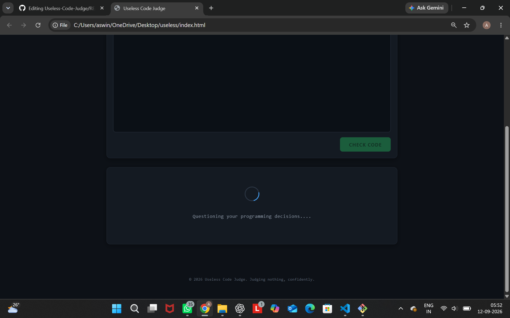
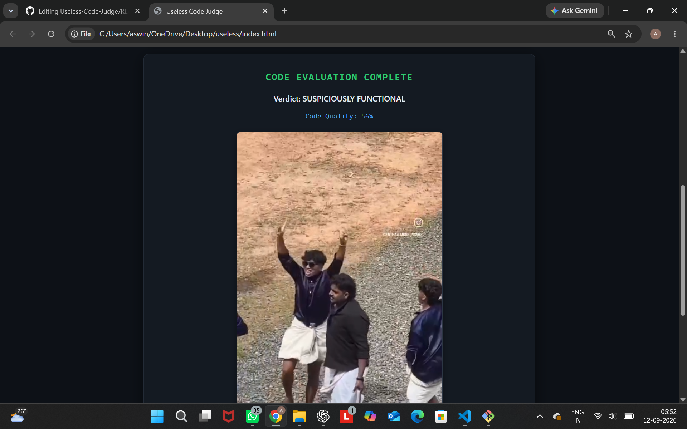

# [Useless Code JUdge] 🎯

## Basic Details
### Team Name: [ERROR 404]

### Team Members
- Team Lead: [Aswin D] - [College of Engineering Trikaripur]
- Member 2: [Sooryanandhan M] - [College of Engineering Trikaripur]

### Project Description
[Our project judges you for whatver code you write.]

### The Problem (that doesn't exist)
[we coders expecially are shy of others judging.]

### The Solution (that nobody asked for)
[Our program judges you to make you hard.]

## Technical Details
### Technologies/Components Used
For Software:
- [HTML,CSS,JavaScript]
- [None]
- [None]
- [VS Code,Chrome,Claude ai,ChatGPT]

### Implementation
For Software:
# Installation
[commands]

# Run
[commands]

### Project Documentation
For Software:

# Screenshots (Add at least 3)

# Diagrams

*Add caption explaining your workflow*

### Project Demo
# Video

https://github.com/user-attachments/assets/7a5de560-95dd-4265-bb5a-84610f7ab473

## Team Contributions
- [Sooryanandhan M]: [REsource picking,Coding,DEbugging]
- [Aswin D]: [Coding,Debugging]

---
Made with ❤️ at TinkerHub Useless Projects 

